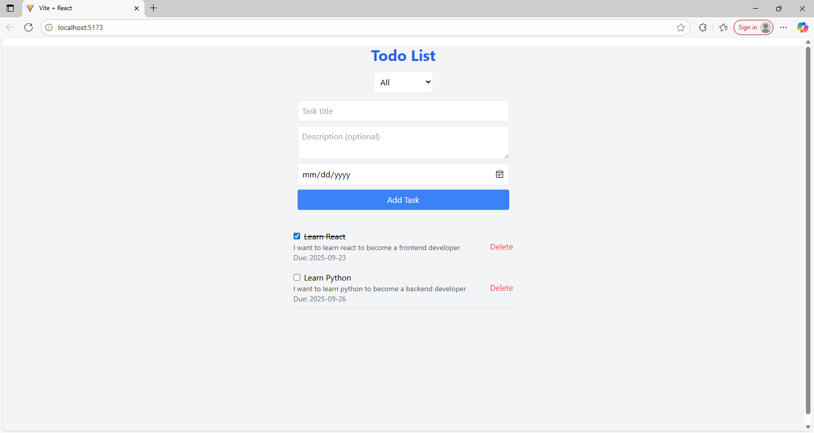

# Todo List Web App

A responsive task management application built with React, Vite, and Tailwind CSS. It allows users to add, toggle, delete, and filter tasks, with data persistence using LocalStorage.

## Live Demo

[Try it here](https://your-todo-app.netlify.app) <!-- Update with your Netlify URL after deployment -->

## Features

- Add tasks with title, description, and optional due date.
- Toggle task completion status.
- Delete tasks.
- Filter tasks by "All," "Completed," or "Pending."
- Data persistence via LocalStorage (tasks save on refresh).
- Responsive design for mobile and desktop.
- Unit tests for key components (e.g., form submission).

## Tech Stack

- **Frontend**: React (v18.3.1)
- **Build Tool**: Vite (v7.1.6)
- **Styling**: Tailwind CSS (v3.4.3)
- **Testing**: Vitest (v2.1.9) with @testing-library/react
- **Other**: LocalStorage for persistence

## Setup and Installation

1. Clone the repository:
   ```bash
   git clone https://github.com/your-username/todo-list-app.git
   cd todo-list-app
   ```
2. Install dependencies:
   ```bash
   npm install
   ```
3. Run the development server:
   ```bash
   npm run dev
   ```
4. Run tests:
   ```bash
   npm test
   ```

## Architecture and Decisions

- **State Management**:Used React's useState and useEffect for simple, local state handling with LocalStorage persistence.
- **Filtering**: Implemented client-side filtering for quick UI updates.
- **Styling**: Tailwind CSS for rapid, responsive design without custom CSS.
- **Testing**: Basic unit tests with Vitest to verify form submission and component behavior.
- **Challenges**: Ensured compatibility with React 18 and handled dependency conflicts during setup.

## Screenshot



## License

MIT License. Feel free to fork and modify!

## Contact

Bingheng(Ryan) Qiu - 1016bqius@gmail.com
